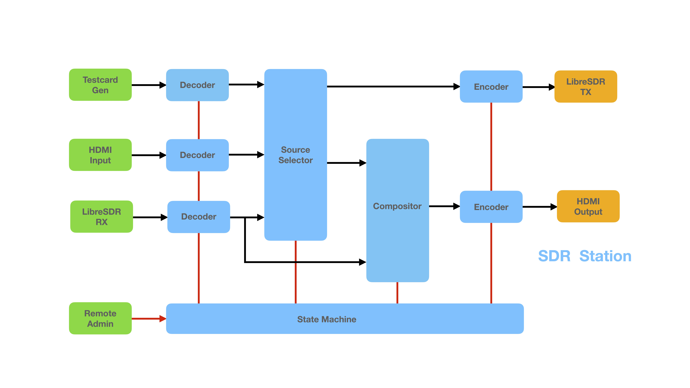

# SDR Station

## Work in Progress
- This project is NOT ready for use
- A beta version will announced in due course
## Intent
- An easy to build 'black box' DATV Transciever
- Runs on a headless Mini PC (minimum spec t.b.a)
- Remote monitor and control from a Web browser over LAN or Internet
- No hardware encoder
- One LibreSDR for TX and RX
- HDMI input from OBS or vMix, etc
- HDMI output monitors RX, TX or split screen
- Built in testcards
- A single .ini configuration file
